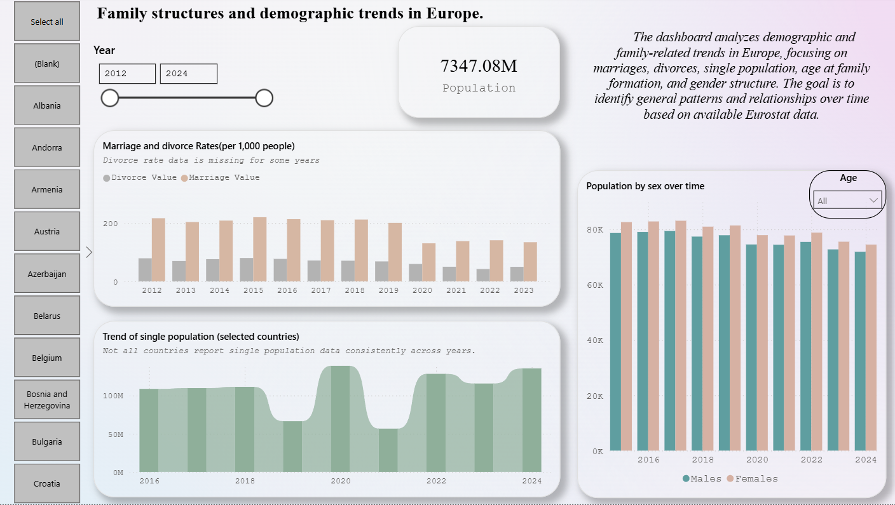
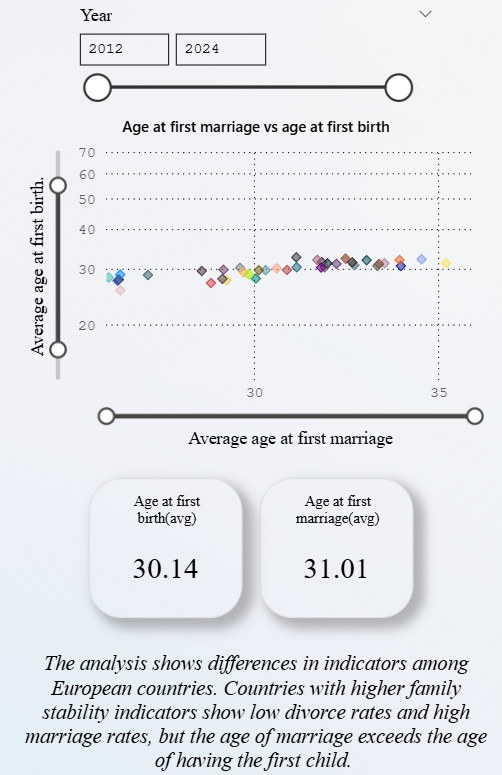
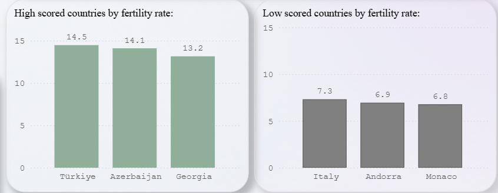

# Family Structures and Demographic Trends in Europe

## 📊 Project Overview
This Power BI dashboard analyzes demographic and family-related trends across European countries. 
The project explores changes in marriage age, fertility rates, divorce rates, population structure, and gender distribution over time.

The goal is to identify long-term demographic patterns and compare differences between developed and developing European countries.

---

## 🎯 Project Objectives
- Analyze trends in marriage and divorce rates (per 1,000 people)
- Examine changes in fertility rates over time
- Compare high and low fertility countries
- Explore population distribution by sex
- Identify general demographic patterns across Europe

---

## 📂 Data Source
Data used in this project comes from **Eurostat**, the statistical office of the European Union.  
The dataset includes demographic indicators for European countries from 2012 to 2024 (depending on availability).

---

## 🛠 Tools & Technologies
- Power BI
- Eurostat datasets
- Data modeling & visualization

---

## 📈 Key Insights
- Fertility rates show a long-term decline in many developed European countries.
- Higher fertility levels are observed in countries with earlier family formation patterns.
- Marriage rates have generally decreased over time, with temporary disruptions during crisis periods.
- Population structure trends highlight gradual demographic shifts.

---

## 🖼 Dashboard Preview

### Page 1 – Family Structure Overview

### Page 2 – First marriage ang first childbirth avg. year by countries

### Page 2 – Fertility rates

---

## 📎 Project File
The full Power BI project file (.pbix) is available in this repository.
